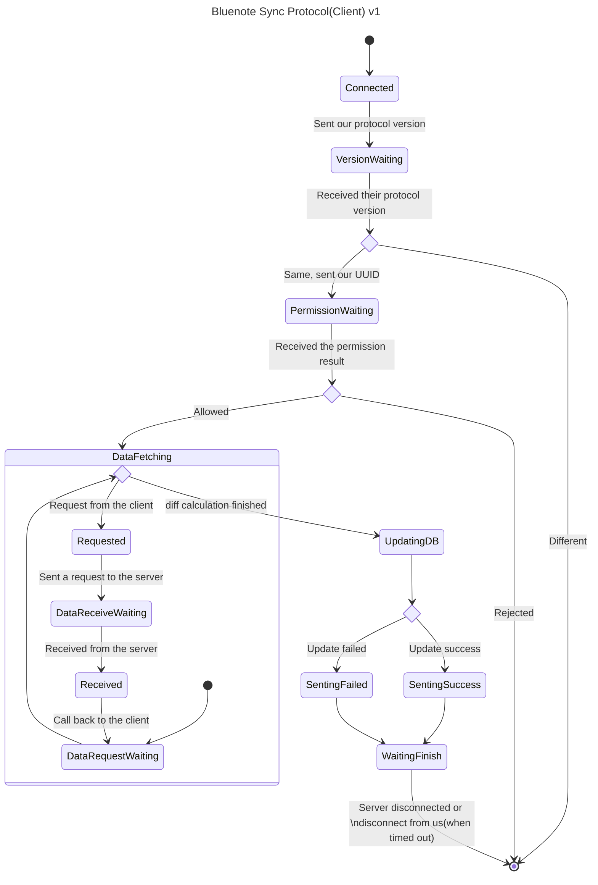
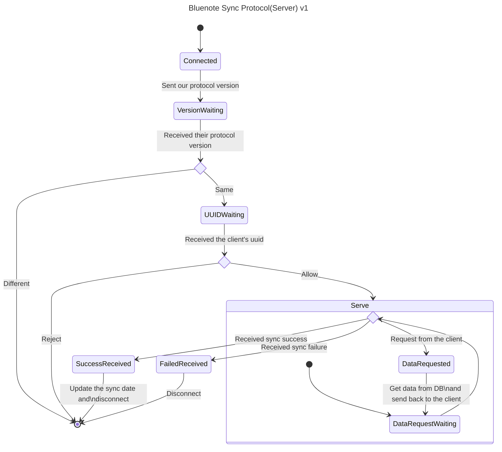

# Bluenote 同期プロトコル v1

## 状態遷移図

```mermaid

---
title: Bluenote Sync Protocol(Client) v1
---

stateDiagram-v2
    state if_version <<choice>>
    state if_permission <<choice>>
    state if_update_success <<choice>>

    [*] --> Connected
    Connected --> VersionWaiting: Sent our protocol version
    VersionWaiting --> if_version: Received their protocol version
    if_version --> [*]: Different
    if_version --> PermissionWaiting: Same, sent our UUID
    PermissionWaiting --> if_permission: Received the permission result
    if_permission --> [*]: Rejected
    if_permission --> DataFetching: Allowed

    state DataFetching {
        state if_sync_finished <<choice>>
        [*] --> DataRequestWaiting
        DataRequestWaiting --> if_sync_finished
        if_sync_finished --> Requested: Request from the client
        Requested --> DataReceiveWaiting: Sent a request to the server
        DataReceiveWaiting --> Received: Received from the server
        Received --> DataRequestWaiting: Call back to the client
    }

    if_sync_finished --> UpdatingDB: diff calculation finished
    UpdatingDB --> if_update_success
    if_update_success --> SentingSuccess: Update success
    if_update_success --> SentingFailed: Update failed
    SentingSuccess --> WaitingFinish
    SentingFailed --> WaitingFinish
    WaitingFinish --> [*]: Server disconnected or \ndisconnect from us(when timed out)
```

```mermaid

---
title: Bluenote Sync Protocol(Server) v1
---

stateDiagram-v2
    state if_version <<choice>>
    state if_uuid <<choice>>

    [*] --> Connected
    Connected --> VersionWaiting: Sent our protocol version
    VersionWaiting --> if_version: Received their protocol version
    if_version --> [*]: Different
    if_version --> UUIDWaiting: Same
    UUIDWaiting --> if_uuid: Received the client's uuid
    if_uuid --> [*]: Reject
    if_uuid --> Serve: Allow

    state Serve {
        state client_request <<choice>>
        [*] --> DataRequestWaiting
        DataRequestWaiting --> client_request
        client_request --> DataRequested: Request from the client
        DataRequested --> DataRequestWaiting: Get data from DB\nand send back to the client
    }

    client_request --> SuccessReceived: Received sync success
    client_request --> FailedReceived: Received sync failure

    SuccessReceived --> [*]: Update the sync date and\ndisconnect
    FailedReceived --> [*]: Disconnect
```
