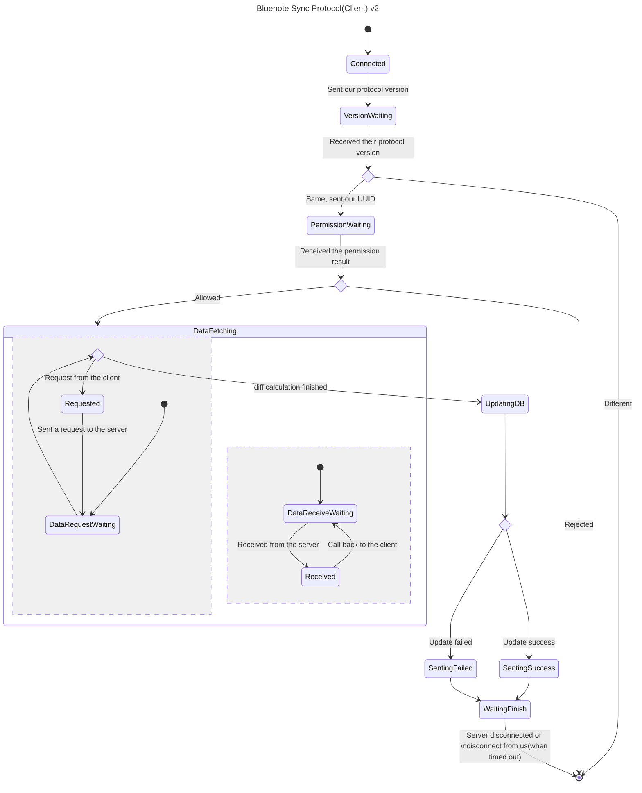
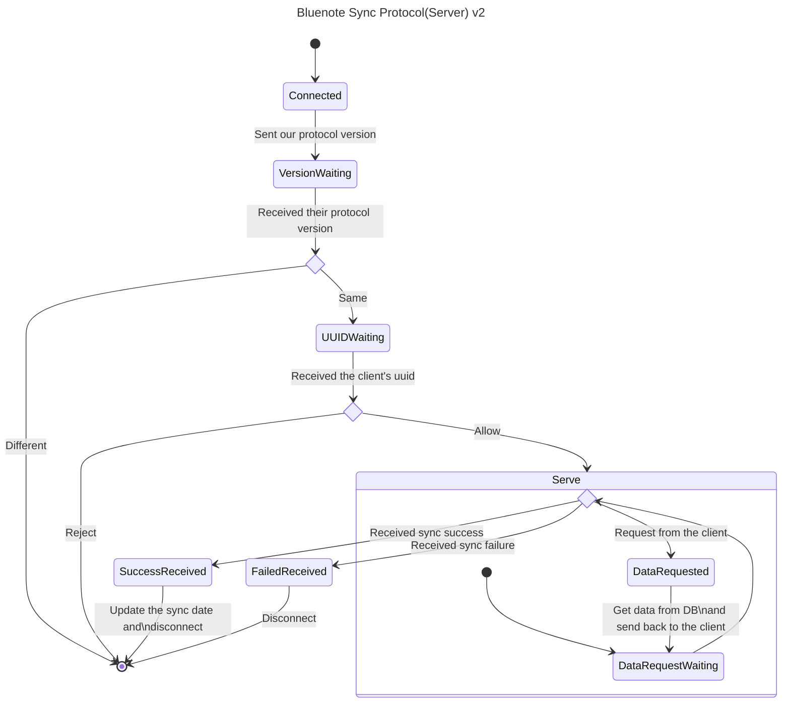

# Bluenote 同期プロトコル v2

## v1 との違い

データ取得フェーズで、データ要求とデータ受信を並行して行うように変更。
変更に伴って、各リクエストにリクエスト ID を付与するように変更する。

- 現状でも（スレッドの更新リクエスト以外の）リクエストはスレッド、もしくはメモの UUID を送信しているため、リクエストの判別にはこれを使えばいい気がする
- スレッドの更新リクエストは、返却時のリクエスト ID 欄を空文字列にするとかでよさげ

## 改善ポイント

n 個のデータ取得リクエストを送るとし、通信には x 秒の遅延時間がかかるとする (送信して相手に到着するまでにかかる時間が x + データサイズ/帯域幅となると仮定)と、各プロトコルでの処理時間は

- v2

  - (x + リクエストデータサイズ/帯域幅 + DB アクセス時間 + 返却データサイズ/帯域幅 + x) \* n
  - = nx + 総リクエストデータサイズ/帯域幅 + 総 DB アクセス時間 + 総返却データサイズ/帯域幅 + nx

- v3
  - x + 総リクエストデータサイズ/帯域幅 + 総 DB アクセス時間 + 総返却データサイズ/帯域幅 + x
    - 実際は DB アクセスと返却も並行なので、これより短くなるはず

したがって、処理時間が 2(n-1)x + α 短くなると予想される。

## 状態遷移図

